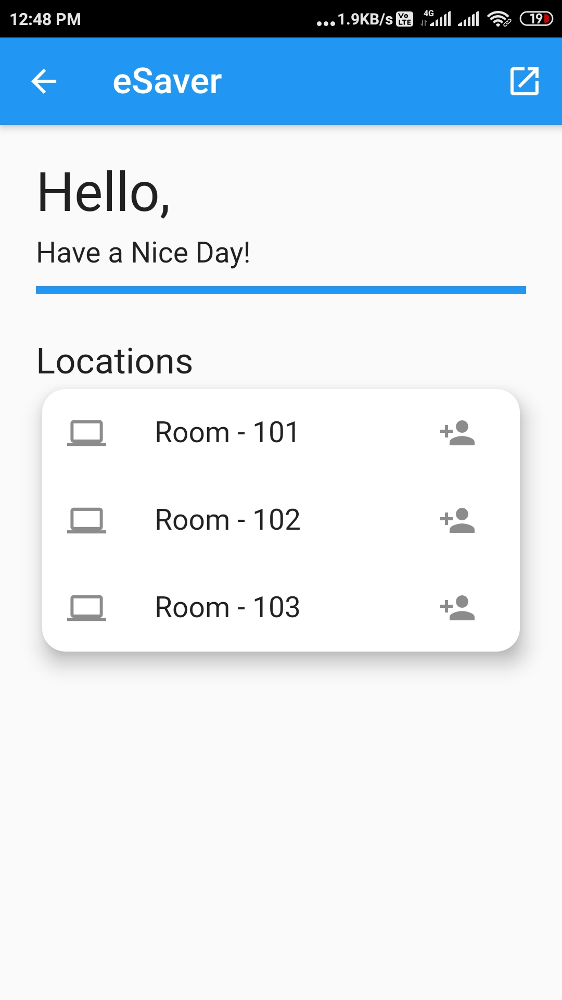
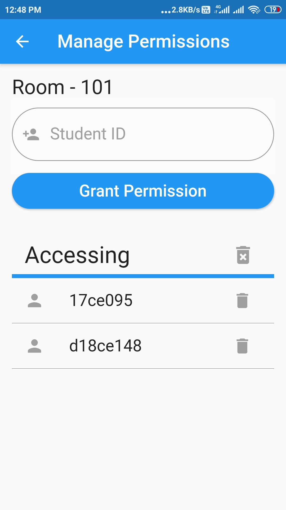
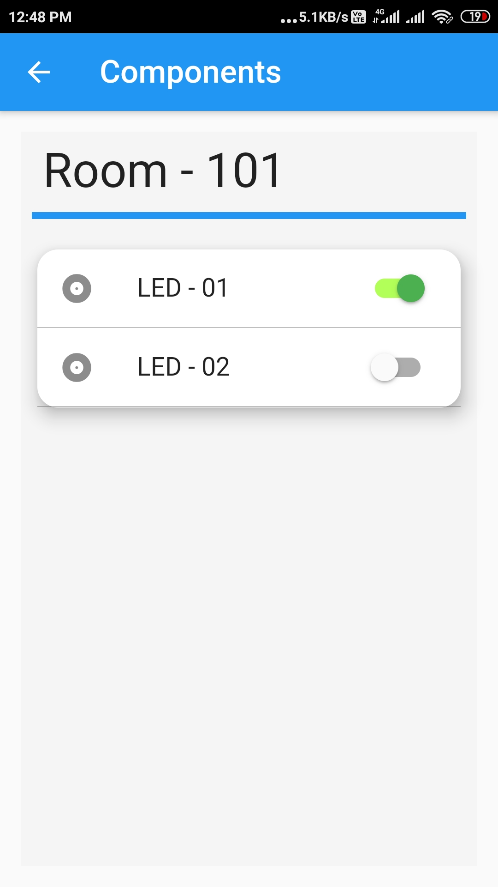
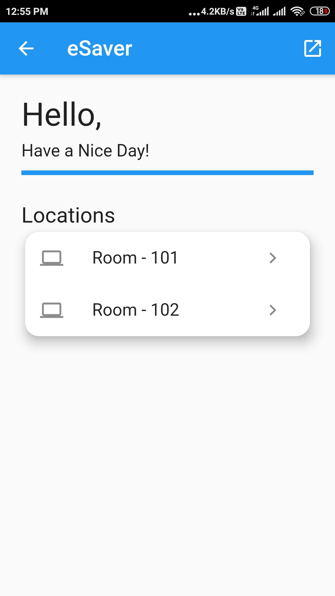
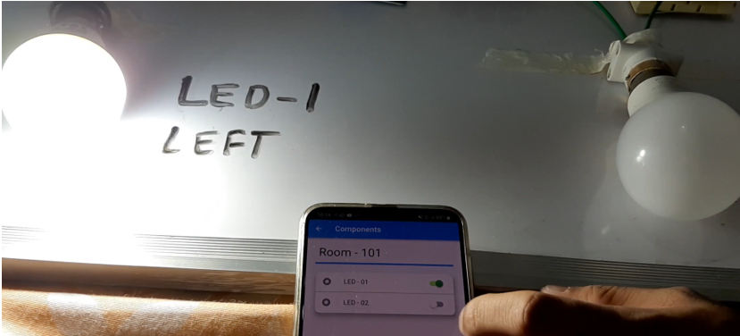

# eSaver

*Too much wastage of electricity in the computer labs and classrooms? Use eSaver to control electrical components smartly!*

Our prototype solution has been built for controlling the LEDs right now, and we can similarly include other electrical components. It assumes the scenario of colleges or similar offices where there are two privileged classes: at higher level, Faculties/Employers who have the access to manage permissions, and Students/Employees who can access the components if they are permitted by their higher class. 

## Technologies used

Flutter

Django Rest Framework 

Computer Vision 

Internet of Things

## Application Features

* Access available electrical components at locations permitted to the user

* If the user is admin, can manage access permissions of the locations, i.e. give or take access at any moment

*Automatic turning on and off of the electrical components occurs based on the presence of people at that particular location. If accessed via mobile app, it has higher priority than automatic detection.*

## Android screenshots

    

## Demo of the project

 

### Link to the demo videos:

Intelligent Control System Part -1: https://youtu.be/X-nzhUl9v1k

Intelligent Control System Part -2: https://youtu.be/kmXmurr8Y8E

